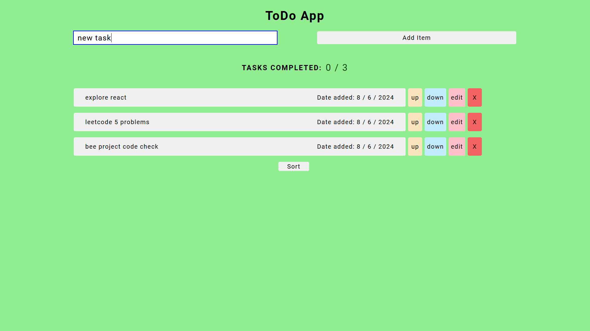
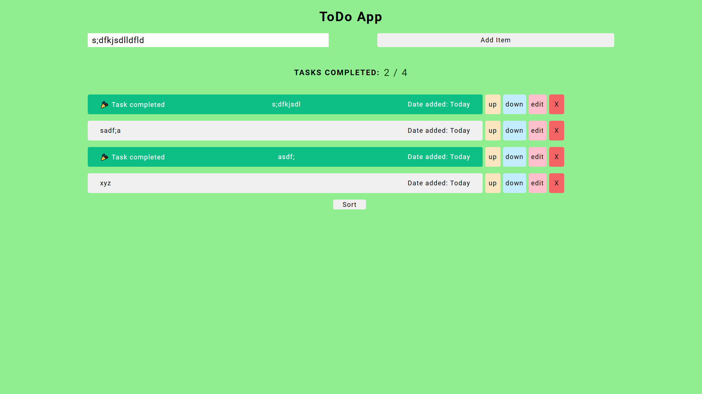
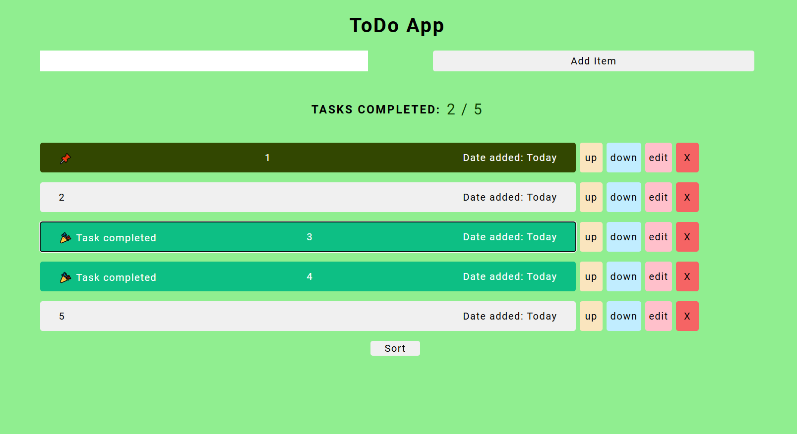

# todolist

this is a todo list made with react

## Goals for near future (one week)

- input field
- task EDIT (DELETE ONLY AFTER TASK GETS EDITED
- OTHERWISE KEEP INTACT)
- DATE ADDED TODAY (each just below one another)
- noticeable hovering for buttons (up
- down)
- transition for up/down
- TRANSITION FOR DELETING AN ITEM
- SORTING BASED on different attributes (like name
- date)
- beautify sort button
- ADD UNIFORMITY TO THE OVERALL COLOR STRUCTURE OF THE PAGE
- TASK COMPLETED
- SMOOTH TRANSITION FOR PINNING AN ITEM

## How to use!

- `git clone https://github.com/Shubham-kpl/todolist` to clone repository to your device

- run `npm install` to install related dependencies

- run `npm start` to run project in your local server

## Future improvements

- add icons for done and pin
- pin element
- notification on doing every event
- progress bar task completion
- progress bar upon going down
- maintain ordering of tasks on reload
- undo option
- warning on deleting
- celebration on task completion
- task completion slider
- rename todo list on clicking it
- add due date (calendar in form)
- form transition
