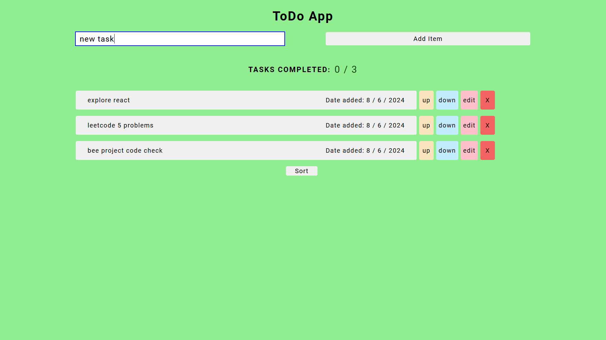
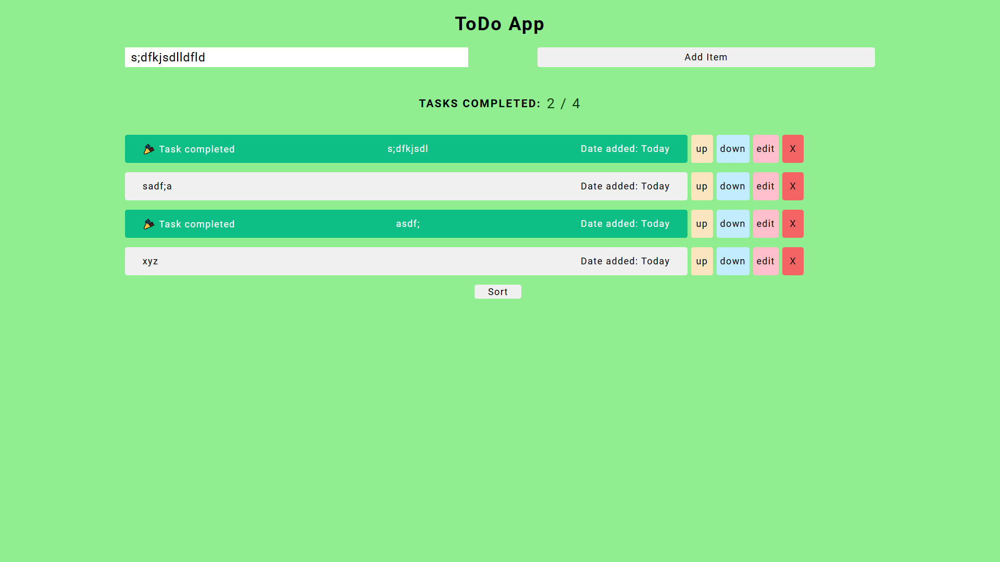
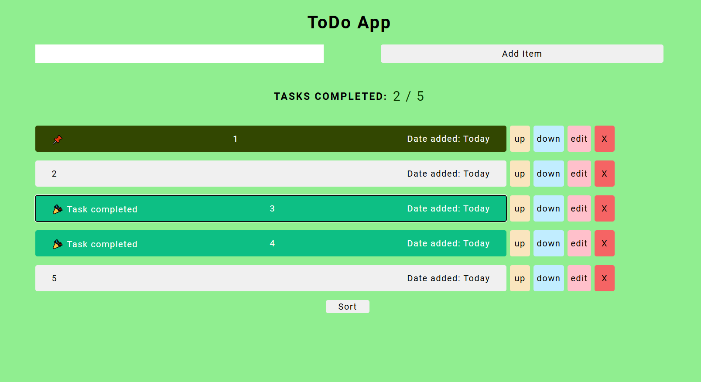

# todolist

this is a todo list made with react
The website is live at <a href="https://www.todolist-pi-umber.vercel.app">To-do-list-in-react</a>

## Goals for near future (one week)

- input field
- task EDIT (DELETE ONLY AFTER TASK GETS EDITED
- OTHERWISE KEEP INTACT)
- task completed date
- DATE ADDED TODAY (each just below one another)
- noticeable hovering for buttons (up
- down)
- transition for up/down
- TRANSITION FOR DELETING AN ITEM
- SORTING BASED on different attributes (like name
- date)
- beautify sort button
- ADD UNIFORMITY TO THE OVERALL COLOR STRUCTURE OF THE PAGE
- TASK COMPLETED
- SMOOTH TRANSITION FOR PINNING AN ITEM
- DEPLOY IN OTHER PLATFORM (PAGES, RENDER, ETC)

## How to use!

- `git clone https://github.com/Shubham-kpl/todolist` to clone repository to your device

- run `npm install` to install related dependencies

- run `npm start` to run project in your local server

## Future improvements

- add icons for done and pin
- pin element
- notification on doing every event
- progress bar task completion
- progress bar upon going down
- maintain ordering of tasks on reload
- undo option
- warning on deleting
- celebration on task completion
- task completion slider
- rename todo list on clicking it
- add due date (calendar in form)
- form transition

## Further

1. why active class' color in the task is not fading after double clicking it
2. why upon inputting empty task, it goes below
3. line break class
4. transition not workingin error message element
5. handle arrow up , arrow down
6. if format of new task changes, change the format of the existing tasks too
7. can we pin an element by passing to a function
